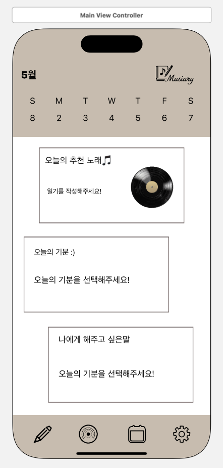
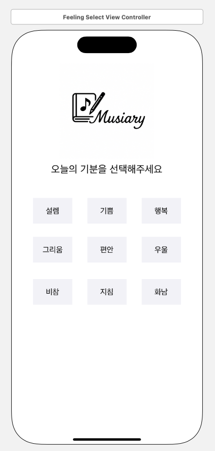
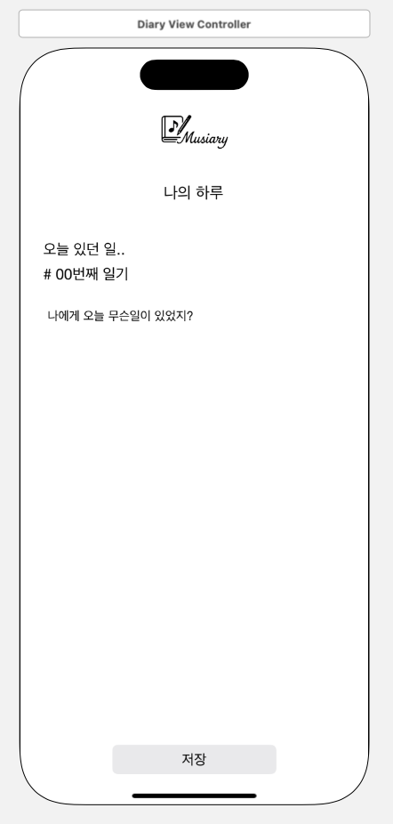
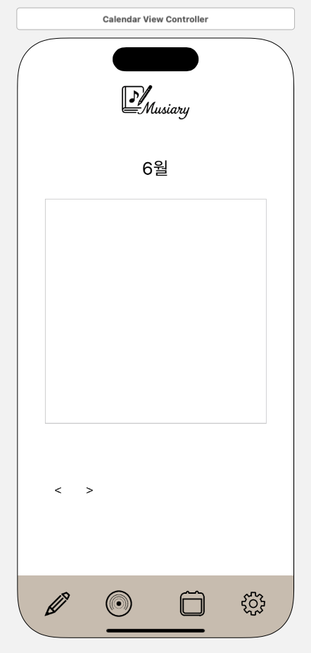
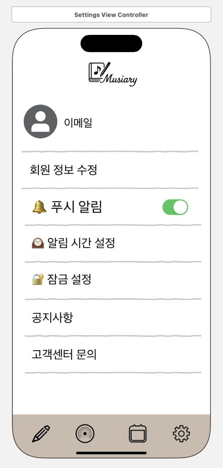
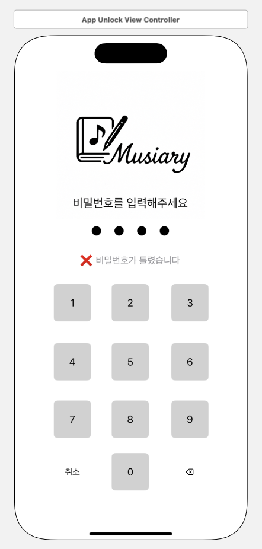

# 🎵 Musiary
## 감정을 음악으로 기록하자

> 바쁜 일상 속 감정이 묻히기 쉬운 현대인들이, 짧은 일기 몇 줄로 자신의 감정을 돌아보고 위로받을 수 있도록 제작된 감성 기록 앱

[▶️ Musiary 발표 자료 다운로드 (PPTX)](./Musiary_뮤지어리.pptx)  
[📄 Musiary 발표 자료 보기 (PDF)](./Musiary_뮤지어리.pdf)

---

## 📚 목차

- [📽️ 데모 영상](#-데모-영상)  
- [🖼️ 앱 실행 화면](#-앱-실행-화면)  
- [⚙️ 주요 기능 요약](#-주요-기능-요약)  
- [📦 프로젝트 구성](#-프로젝트-구성)  
- [💻 설치 방법](#-설치-방법)  
- [🧰 기술 스택](#-기술-스택)  
- [📱 테스트 환경](#-테스트-환경)  
- [📝 사용법](#-사용법)  
- [👩‍💻 프로그래머 정보](#-프로그래머-정보)  
- [🐞 버그 및 디버그 정보](#-버그-및-디버그-정보)  
- [🚀 버전 및 업데이트](#-버전-및-업데이트)  
- [🔗 참고 및 출처](#-참고-및-출처)  
- [📜 라이선스](#-라이선스)  
- [❓ FAQ](#-faq)

---

## 📽️ 데모 영상

| 기능 | 영상 링크 |
|------|-----------|
| 달력 화면 | [🔗 바로보기](https://youtube.com/shorts/Gy8pKY1qYOQ?feature=share) |
| 설정 화면 | [🔗 바로보기](https://youtube.com/shorts/p5d6pR_KJF8?feature=share) |
| 오늘의 기분 & 다이어리 | [🔗 바로보기](https://youtube.com/shorts/p5d6pR_KJF8?feature=share) |
| 로그인 / 회원가입 | [🔗 바로보기](https://youtube.com/shorts/wQ1W1s4ducM?feature=share) |

---

## 🖼️ 앱 실행 화면

| 홈 화면 | 감정 선택 | 일기 작성 | 달력 | 설정 화면 | 잠금 화면 |
|---------|-----------|------------|------------|------------|------------|
|  |  |  |  |  |  |

---

## ⚙️ 주요 기능 요약

- 🧠 감정 키워드 선택 (9종: 설렘, 기쁨, 행복, 그리움, 편안, 우울, 비참, 지침, 화남)  
- ✏️ 일기 작성 + 감정 기반 추천 음악 출력  
- 💬 명언 표시 기능 (홈 화면에 랜덤 명언 제공)  
- 🔐 잠금 기능 (4자리 PIN)  
- 🔔 푸시 알림 시간 설정 기능  

---

## 📦 프로젝트 구성

| 파일 | 설명 |
|------|------|
| `Main.storyboard` | 전체 UI 구성 |
| `MainViewController.swift` | 홈 화면 기능 제어 |
| `DiaryViewController.swift` | 일기 작성 화면 기능 |
| `FeelingSelectViewController.swift` | 감정 선택 팝업 기능 |
| `SettingsViewController.swift` | 설정 및 잠금 기능 |
| `AppLockViewController.swift` | PIN 입력 화면 |
| `PasswordChangeViewController.swift` | 비밀번호 변경 기능 |

---

## 💻 설치 방법

1. 본 레포지토리를 클론합니다.
2. `Musiary.xcodeproj` 파일을 Xcode로 실행합니다.
3. iOS 시뮬레이터 또는 실제 기기에서 빌드하여 실행합니다.
4. 최소 지원 버전: **iOS 16 이상 / Xcode 15 이상**

---

## 🧰 기술 스택

| 분류 | 사용 기술 |
|------|------------|
| 언어 | Swift 5 |
| UI 구성 | UIKit, Auto Layout |
| 데이터 저장 | UserDefaults (Firebase 예정) |
| 빌드 환경 | Xcode 15 이상 |
| 기타 도구 | Apple Music API (예정), GitHub, YouTube |

---

## 📱 테스트 환경

- iPhone 13  
- iOS 17.5  
- Xcode 15.3  

---

## 📝 사용법

- **홈 화면**: 오늘의 감정 키워드, 명언, 추천 음악 확인  
- **✏️ 버튼**: 일기 작성 팝업 화면 열기  
- **감정 선택**: 팝업으로 뜨는 화면에서 감정 선택  
- **설정**: 잠금 설정, 알림 시간 지정 등 가능  
- **일기 저장 시**: 감정 기반으로 추천 음악이 자동 출력됨  

---

## 👩‍💻 프로그래머 정보

| 이름 | 담당 |
|------|------|
| 박다현 | 메인 UI/UX 기획, 기능 개발 총괄, 잠금 기능 개발, 일기 저장 로직 |
| 이나윤 | 메인 UI/UX 기획 |

---

## 🐞 버그 및 디버그 정보

- 음악 추천이 안 뜨는 경우 있음 (일기 미저장 시)  
- 감정 선택 팝업이 중복 실행되는 버그 있음  
- 앱 잠금 기능 일부 비정상 동작 (수정 중)  

---

## 🚀 버전 및 업데이트

| 버전 | 내용 |
|------|------|
| 1.0.0 | 기본 기능 완성 및 GitHub 업로드 |
| 1.1.0 (예정) | Firebase 연동, 감정 분석 기반 AI 추천 기능 추가 예정 |

---

## 🔗 참고 및 출처

- Apple Music API (예정)
- Swift 5 / UIKit / Xcode 15 / iOS 16
- GitHub, Firebase (추후 연동 예정)

---

## 📜 라이선스

본 프로젝트는 **학습 및 비상업적 목적에 한하여 자유롭게 사용 가능합니다.**  
무단 상업적 이용은 금지되어 있으며, 이미지 및 음악 자료의 저작권은 각 소유자에게 있습니다.

---

## ❓ FAQ

**Q. 일기를 작성하지 않으면 추천 노래가 안 뜨나요?**  
A. 네. 일기 저장을 완료해야 추천 노래가 출력됩니다.

**Q. 감정 키워드는 몇 개인가요?**  
A. 총 9가지 감정을 지원합니다: 설렘, 기쁨, 행복, 그리움, 편안, 우울, 비참, 지침, 화남
